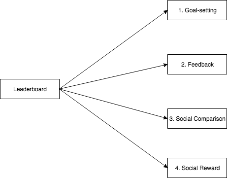

# How to Motivate With Leaderboards: Stop Making Losers

>Winning doesn't mean anything unless someone else loses — The Man in Black, Westworld

Leaderboards have become a common behavior change design pattern. Originally included in video games, leaderboards have started to infiltrate "gamified" products such as...

* Nike+, a fitness wearable device, which motivates users to exercise more by competing against their friends for activity points.
* Opower, an energy tracking platform, which motivate users to reduce their energy use by showing how much energy they use compared to their neighbors.
* Github, a project management platform for programmers, which motivates users to contribute to projects more by publicly displaying the number of contributions to projects by made by individual community members.

Product managers and designers use leaderboards to motivate people to use their products more. The commonly-held belief is that leaderboards are motivating because people like to win and winning is motivating because it gives us status in our [communities](http://habitry.link/community). But some people don't want to win; they want to avoid losing.

### Competition: A Problem of Competence

"Wanting to win" versus "wanting to avoid losing" is a subtle yet crucial distinction and Murayama and Elliot's (2012) set of meta-analyses found the effects of competition depend on this distinction in the minds of players. When someone wants to perform better than others, they tend to benefit from competition. But when they want to avoid performing worse than others, competing tends to _reduce_ their performance. Similarly, Burnette et al's (2013) meta-analysis found that the desire to win is positively related to goal achievement, whereas the desire to avoid losing is _negatively_ related to goal achievement (yay replication). Finally, Senko et al's (2017) meta-analysis found that the desire to win improves achievement only when it's accompanied by strategies that support feelings of mastery rather than helplessness. So even "wanting to win" is alone not enough to inoculate players from the downsides of competitive social environments.

Design patterns that foster competition—like leaderboards—don't improve motivation and performance for all users in all situations. Competition is good for motivation and achievement only when it helps users feel competent. Leaderboards are a motivation problem, and you can design for that.

# Designing a Motivational Leaderboard

>A finite game is played for the purpose of winning, an infinite game for the purpose of continuing the play — James P. Carse

[Self-Determination Theory](http://habitry.link/motivating-humans) posits that human beings seek and engage with activities that promise and satisfy three Basic Psychological Needs. All user interactions with an interface can support or frustrate the satisfaction of these Basic Psychological Needs (Peters, Calvo, & Ryan, 2018). So if you want to design a motivational leaderboard—and hopefully avoid accidentally demotiving a large sub-section of the people looking at it—you must design with these three needs in mind.

A great leaderboard supports **competence**, which is the satisfaction you get when you complete a challenging goal. You feel masterful and effective; that you're achieving things. The opposite of competence is feeling ineffective and helpless.

A great leaderboard should support **relatedness**, the satisfaction you get when you feel understood and liked by people you care about. You feel closer to the people you're playing with. The opposite of relatedness is feeling rejected and disconnected.

Finally, a great leaderboard should support **autonomy**, the satisfaction you get when you act with a sense of personal commitment and choice. The opposite of autonomy is feeling coerced and manipulated.

Well designed leaderboards promote the satisfaction of competence, relatedness, and autonomy for most users, most of the time, and most importantly, they don't pit these needs against each other. For example, a risk with leaderboards is communicating to players that they must choose between competence or relatedness. A leaderboard can do this by communicating that we are in a zero-sum competition against the people we are playing with, therefore they can only satisfy competence for a few users at the price of frustrating relatedness for many.

Think about it like a "game night" with some friends. For most people, the point of a game night is the excuse to hang out and be with each other (relatedness). Most board games are designed with low stakes (Monopoly money not being legal tender) and cooperative play (teams, couples, etc) in order prevent competition from pitting relatedness against competence. But if you pick a game that is designed differently, like Strip Poker or a full-on Fight Club, then you'll more than likely see more negative impacts on the motivation of your friends than positive ones. Some would no doubt leave rather than participate and potentially wreck their friendship and some who played would feel coerced into playing (both examples being the need for relatedness pitted against the need for autonomy). Even those who did play would likely start to feel different as clothes came off or noses bled.

But we can break down leaderboards into their behavior change elements and examine the impact that each element has on Basic Psychological Needs. And in doing that, show you how you can design these elements so that they satisfy competence, relatedness, and autonomy without pitting them against each other.

#### The Mantra: Competence and Connection over Competition

# Behavior Change Elements of a Leaderboard

A Behavior Change Technique is an "active ingredient that brings about behavior change" (Michie et al. 2013). The Human Behavior Change Project has identified 88 of these "BCTs" in research and most leaderboards are a system of four of these BCTs:

In turn, each of these behavior change techniques can support or frustrate the three [Basic Psychological Needs](http://habitry.link/motivating-humans).

Let's walk through how you can design each behavior change technique to support the Basic Psychological Needs rather than frustrate them.

## 1. Goal-setting

A goal is the aim of an action (Locke & Latham, 2013). Goal-setting involves giving or guiding a user toward a goal and has become recommended as an effective building block for behavior change (Epton, Currie, Armitage, 2017).

"Get the number 1 ranking" is the default goal that is communicated by most leaderboards. No one has to say it; the design itself tells players to make "be highest on the board" their goal.

* Nike+ ranks people on fitness activity points. The goal is to get the most activity points.
* Opower, ranks people on kWh/day of energy use. The goal is to minimize energy use.
* Github ranks people on number of contributions to a project. The goal is to maximize your contributions.

All goals are not created equal, however, and all goals are context-dependent. Some goals support Basic Psychological Needs and some goals can thwart them depending on the person, the situation, and the social environment. "Run a marathon" can be a motivating goal to a middle-aged white person, whereas "run a marathon" can be a neutral goal to a Kenyan kid struggling in poverty. Like Dennis Kipruto Kimetto, the 34yo world-record holder in the marathon who didn't start running competitively until he was 27 because he didn't think running could feed his family.

Here are some suggestions to for how to design goals that support the most needs of the most people instead of thwarting them, so that people will use your product long enough to actually benefit from it.

### Provide a motivational "why"

Give your users a reason why putting in effort to compete on your leaderboard might be worth the effort  that is meaningful _to them_ (Steingut, Patall, & Trimble, 2017). From a Self-Determination Theory perspective, many products damage long-term user engagement because they provide people with The Wrong Whys.

The Wrong Whys include:
- Emphasizing meaningless incentives. Example: "You should play because you'll win all the points!"
- Emphasizing boosting ego and pride. Example: "You should play to win because only the best and smartest people win!"
- Emphasizing outcomes people don't control. Example: "You should play so you remain physically attractive to others."

All of these "whys" accidentally communicate that participation in your product runs the risk of making them feel stupid, isolated, and manipulated.

The Right Whys include:
- Emphasizing fun, enjoyment, or interest. Example: "Play because it's fun and you'll learn interesting facts about yourself!"
- Emphasizing alignment with user personal values or desired social identity. Example: "We play because we're a fun-loving community who help each other to become better people!"
- Emphasizing autonomy. Example: "You may like playing this" instead of "You must play this".

### Nest extrinsic goals inside of intrinsic goals

We strongly recommend giving users intrinsic goals over extrinsic goals. Intrinsic goals are about pursuing ends that are inherently valuable to us, such as having fun, achieving mastery, and building close relationships. Extrinsic goals are about pursuing instrumental outcomes such as wealth, fame, and hotness. In general, intrinsic goals...
1. Satisfy our Basic Psychological Needs better than extrinsic goals (Grouzet et al 2005).
2. Get us to put in more effort than extrinsic goals (Vansteenkiste, Simons, Lens, Sheldon, & Deci, 2004; Vansteenkiste, Simons, Soenens, & Lens, 2004).
3. Can feel easier to pursue than extrinsic goals (Werner, Milyavskaya, Foxen-craft, & Koestner, 2016).
4. Promote deeper learning compared to extrinsic goals (Vansteenkiste, Simons, Lens, Soenens, & Matos, 2005; Vansteenkiste, Timmermans, Lens, Soenens, & Van den Broeck, 2008)
5. Promote enhanced focus on the task at hand, compared to extrinsic goals (Vansteenkiste, Matos, Lens, & Soenens, 2007).
6. Perhaps most interestingly, pursuing extrinsic goals for intrinsic reasons, like aiming to make money to support your family, is more supportive of the Basic Psychological Needs than pursuing an extrinsic goal for extrinsic reasons (Landry et al. 2016).

Give your users intrinsic goals rather than extrinsic goals.

- Example of an intrinsic goal: Aim to improve your skills.
- Example of an extrinsic goal: Aim to become famous.

If you must use an extrinsic goal, nest it inside an intrinsic one.

- Example: Play to win points (an extrinsic goal because points are extrinsic to the activity), but most importantly, play to contribute to our project that is making the world a better place (intrinsic because most people would agree making the world a better place is inherently valuable).

The most motivational goal would be an intrinsic goal done for intrinsic reasons.

- Example: Play because it's fun and because it'll make the world a better place.

### Nest individual goals inside of team goals

Make competing more about playing with others rather than being top dog. For example, show your users how pursuing their individual goals helps other people on their team (Grant, 2012). This supports relatedness because it encourages users to work with each other rather than against each other.

Nike+ comes close to pulling this off when they say, "With group goals, you can get to green together." But then they pit competence against relatedness by saying, "Or compete individually for the top slot on the leaderboard." They could fix this by saying something like, "Or focus on improving your personal score."

## 2. Feedback

Feedback lets users know the progress they are making from Point A (where they are) to Point B (their goal). Whenever someone checks your leaderboard, they are receiving feedback.

* Nike+ tells people how many activity points they've earned.
* Opower, tells people how much energy they are using.
* Github tells people the number of commits they've made to a project.

Well designed feedback can promote feelings of competence and mastery. In general, the more often people check their progress, the more progress they make (Harkin et al. 2016), so it's a good idea to design feedback that people find useful and enjoyable. Here are some tactics for doing so.

### Provide feedback on meaningful standards

Provide users with feedback on standards that meaningful to them, given their goals. Below an example from Google's Grasshopper. Users are being given feedback during onboarding. Specifically, it's telling users how to make a choice (autonomy support) and letting them feel good about making the choice (competence support). It also lets users know they are in the "right place", which also supports competence.

### Provide multiple levels of feedback

Provide users with multiple ways to assess their progress, but in the beginning focus mostly on process and performance feedback because those metrics are the most under user control, and therefore have the greatest potential to support user competence.

| |Process|Performance|Outcome|
| ---: | :---: |:---:| :---:|
| **Directional** | "You exercised more this week!” | “Your blood pressure is lower.” | “You are moving closer to your goal weight.”
| **Normative** | “Most people exercise 45min a week.” | “Most people can run a mile.” | “Most people lose 10lbs in this program.”
| **Comparative** | “That’s more than 90% of the people in this program have walked!” | “That’s lower cholesterol than 90% of the people in this program.” | “You have a lower risk for heart disease than 90% of the people in this program!”
| **Identity** | “All that extra walking has moved you into the _Hikers_ category!” | “Your blood pressure numbers put you in the ‘moderate risk’ category.” | “You are now a healthy person.”

### Provide juicy feedback

Juicy feedback is varied, unexpectedly excessive sensual positive feedback on small user actions and achievements can instill a sense of competence even without a big challenge to overcome (Deterding, 2015). Here's another example from Google's Grasshopper:

## 3. Social Comparison

Social comparison is used to show users how they are doing in relation to other people. Whenever you display rankings to your users, you are employing social comparison.

* Nike+ ranks people on fitness activity points.
* OPower ranks people on how much energy they use in comparison with their neighbors.  
* Github ranks contributors based on how many commits they make to each project.

Social comparison is a tricky behavior change technique. Done well, it can support competence and relatedness. Done poorly, it will make people feel ineffective and excluded. By default, people choose to compare themselves to people who are better than them on some quality (Gerber, Wheeler, & Suls, 2018). We compare upwards even when we receive negative feedback. This is surprising because you could make the argument that after we receive negative feedback, we compare ourselves to someone worse off than us to feel better about ourselves. But people compare upwards instead. And this upward comparison effect is stronger when we compare ourselves on ability, or on a dimension we don't understand well. The big risk with social comparison is that people compare themselves to people above them, resulting in reduced competence and relatedness.

Another risk with social comparison is that it "works" in the short term. Feelings of inferiority and exclusion can push people to do what you want them to do with your product. Yet, this might come at the price of their long-term engagement with your product. Eventually, people quit using things that make them feel chronically guilty and shameful.

Here are some suggestions to design social comparison so that supports Basic Psychological Needs instead of frustrating them.

### Take the sting out of losing

Winning, losing, ranking, it’s almost impossible not to form an opinion on “how am I doing in comparison with others” in an competitive environment. Winning obviously feels great, but losing, not so much. Here are some ways to take the edge off losing:

Tell losers they met a competence-satisfying standard, even if they lost (Vansteenkiste & Deci, 2003).

- Example: You made more commits than 70% of the people in this project!

Tell losers why they got the score they got (so they can learn how to improve, which supports competence and so they know the game is fair, which supports relatedness).

- Example:

Acknowledge that losing might suck (this supports autonomy because you aren't making them feel bad about feeling bad).

- Example:

Give losers a choice to keep playing or not (this supports autonomy; Chatzisarantis, Kee, Thaung, & Hagger, 2012). Example: 

### Keep the focus on "playing and connecting" rather than on winning

Keep winners and losers focused on playing well rather than achieving victory (Standage, Dude, & Pensgaard 2005) by providing some suggestions on how they can have more fun,  improve, or connect with other players.
- Example:

Losing with a teammate is less demotivating than losing alone  (Standage, Dude, & Pensgaard 2005), so emphasize connections and relationships.

- Example:

### Compare people on a metric they can improve and have improved

Rank people on how often they choose to play or use your app, rather than on an outcome measure they have less control over (such as pounds of bodyweight lost). The idea is to satisfy their competence. A focus on learning and mastery limits any frustration of competence when you receive a negative social comparison (Chatzisarantis et al 2016; Kamarova et al 2017).

- Example:

### Make it harder to compare

The negative effects of social comparison are less potent when people have to compare themselves to more than two options (Gerber, Wheeler, & Suls, 2018). Take all your instincts about usability and flip them on their head. For example, we know it's hard for people to hold more than seven pieces of information. So compare them to more than 7 people. Alternatively, maybe you can use unique metrics for each person, so that the leaderboard acts more like a place for you to see the personal progress everyone is making, rather than a place to compare yourself to others.

## 4. Social Rewards

Social rewards are non-material/financial incentives given in response to a user putting in some effort. Perhaps the most successful social reward in history is the Facebook Like. Many products justify the use of leaderboards by claiming that winning will win users accolades from people they care about, which will motivate them to keep using the product.

At this point it's well-known that rewards can undermine intrinsic motivation (Cerasoli, Nicklin, & Ford, 2014; Deci, Koestner, & Ryan, 1999), so we should use them carefully. If the behavior you want your users to do is repetitive and boring, linking rewards to effort is justified. If the behavior you want your users to do requires creativity, make rewards surprising and intrinsic.

We can design rewards to limit the damage to Basic Psychological Needs.

### Make them surprising

Predictable rewards tied to effort undermine intrinsic motivation. Make rewards surprising.

- Example:

### Tie them to big picture life goals

-  Example: The more points you earn on our leaderboard, the more we donate to a charity of your choice!

### Use intrinsic or symbolic rewards

- Example: Starbucks rewards card rewards people with more coffee instead of paying them cash.

## Conclusion

- Reminder of why the problem is important for the reader, with an example
- Reminder of their mistaken assumption
- Reminder of a solution

## Links & Notes

- https://github.com/habitry/the_motivator/blob/master/006_research_notes.md
- http://ui-patterns.com/patterns/leaderboard
- https://zurb.com/triggers/achievement/leaderboard-from-fitbit
- https://zurb.com/triggers/achievement/leaderboard-from-nike
- https://elearningindustry.com/sales-gamification-5-leaderboard-mistakes-avoid
- https://medium.muz.li/leaderboard-ui-inspiration-3a511309b07c
- http://enterprise-gamification.com/mediawiki/index.php?title=Leaderboard
- https://medium.com/search?q=gamification%20leaderboard

## References

Burnette, J. L., O'boyle, E. H., VanEpps, E. M., Pollack, J. M., & Finkel, E. J. (2013). Mind-sets matter: A meta-analytic review of implicit theories and self-regulation. *Psychological Bulletin, 139*, 655–701.

Cerasoli, C. P., Nicklin, J. M., & Ford, M. T. (2014). Intrinsic motivation and extrinsic incentives jointly predict performance: A 40-year meta-analysis. Psychological bulletin, 140, 980–1008.

Chatzisarantis, N. L., Ada, E. N., Bing, Q., Papaioannou, A., Prpa, N., & Hagger, M. S. (2016). Clarifying the link between mastery goals and social comparisons in classroom settings. *Contemporary Educational Psychology, 46*, 61-72.

Chatzisarantis, N. L., Kee, Y. H., Thaung, H. K., & Hagger, M. S. (2012). When small losses do not loom larger than small gains: Effects of contextual autonomy support and goal contents on behavioural responses to small losses and small gains. *British Journal of Social Psychology, 51*, 690-708.

Deci, E. L., Koestner, R., & Ryan, R. M. (1999). A meta-analytic review of experiments examining the effects of extrinsic rewards on intrinsic motivation. *Psychological bulletin, 125*, 627-668.

Epton, T., Currie, S., & Armitage, C. J. (2017). Unique effects of setting goals on behavior change: Systematic review and meta-analysis. *Journal of Consulting and Clinical Psychology, 85*, 1182-1198.

Gerber, J. P., Wheeler, L., & Suls, J. (2018). A social comparison theory meta-analysis 60+ years on. Psychological bulletin, 144, 177-197.

Grant, A. M. (2012). Leading with meaning: Beneficiary contact, prosocial impact, and the performance effects of transformational leadership. *Academy of Management Journal, 55*, 458-476.

Grouzet, F. M., Sheldon, K. M., Kasser, T., Ahuvia, A., Dols, J. M. F., Kim, Y., Lau, S., Ryan, R. M., Saunders, S., & Schmuck, P. (2005). The structure of goals across 15 cultures. *Journal of Personality and Social Psychology, 89*, 800-816.

Harkin, B., Webb, T. L., Chang, B. P., Prestwich, A., Conner, M., Kellar, I., Benn, Y., & Sheeran, P. (2016). Does monitoring goal progress promote goal attainment? A meta-analysis of the experimental evidence. *Psychological Bulletin, 142*, 198-229.

Kamarova, S., Chatzisarantis, N. L., Hagger, M. S., Lintunen, T., Hassandra, M., & Papaioannou, A. (2017). Effects of achievement goals on perceptions of competence in conditions of unfavourable social comparisons: The mastery goal advantage effect. *British Journal of Educational Psychology, 87*, 630-646.

Locke, E. A., & Latham, G. P. (Eds.). (2013). New developments in goal setting and task performance. Routledge.

Michie, S., Richardson, M., Johnston, M., Abraham, C., Francis, J., Hardeman, W., Eccles, M. P., Cane, J., & Wood, C. E. (2013). The behavior change technique taxonomy (v1) of 93 hierarchically clustered techniques: building an international consensus for the reporting of behavior change interventions. *Annals of Behavioral Medicine, 46*, 81-95.

Murayama, K., & Elliot, A. J. (2012). The competition–performance relation: A meta-analytic review and test of the opposing processes model of competition and performance. *Psychological Bulletin, 138*, 1035–1070.

Peters, D., Calvo, R. A., & Ryan, R. M. (2018). Designing for Motivation, Engagement and Wellbeing in Digital Experience. *Frontiers in Psychology, 9*, 797–822.

Deterding, S. (2015). The lens of intrinsic skill atoms: A method for gameful design. *Human–Computer Interaction, 30*, 294-335.

Senko, C., & Dawson, B. (2017). Performance-approach goal effects depend on how they are defined: Meta-analytic evidence from multiple educational outcomes. *Journal of Educational Psychology, 109*, 574–600.

Standage, M., Duda, J. L., & Pensgaard, A. M. (2005). The effect of competitive outcome and task-involving, ego-involving, and cooperative structures on the psychological well-being of individuals engaged in a co-ordination task: A self-determination approach. *Motivation and Emotion, 29*, 41-68.

Steingut, R. R., Patall, E. A., & Trimble, S. S. (2017). The effect of rationale provision on motivation and performance outcomes: A meta-analysis. Motivation Science, 3, 19–50.

Landry, A., Kindlein, J., Trépanier, S.-G., Forest, J., Zigarmi, D., Houson, D., & Brodbeck, F. C (2016). Why individuals want money matters: Using self-determination theory to explain the differential relations between motives for making money and employee psychological health. *Motivation and Emotion, 40*, 226-242

Werner, K. M., Milyavskaya, M., Foxen-craft, E., & Koestner, R. (2016). Some goals just feel easier: Self-concordance leads to goal progress through subjective ease, not effort. *Personality and Individual Differences, 96*, 237-242.

Vansteenkiste, M., & Deci, E. L. (2003). Competitively contingent rewards and intrinsic motivation: Can losers remain motivated?. *Motivation and Emotion, 27*, 273-299.

Vansteenkiste, M., Matos, L., Lens, W., & Soenens, B. (2007). Understanding the impact of intrinsic versus extrinsic goal framing on exercise performance: The conflicting role of task and ego involvement. *Psychology of Sport and Exercise, 8*, 771-794.

Vansteenkiste, M., Simons, J., Lens, W., Sheldon, K. M., & Deci, E. L. (2004). Motivating learning, performance, and persistence: The synergistic role of intrinsic goals and autonomy-support. Journal of Personality and Social Psychology, 87, 246-260.

Vansteenkiste, M., Simons, J., Soenens, B., & Lens, W. (2004). How to become a persevering exerciser? Providing a clear, future intrinsic goal in an autonomy-supportive way. *Journal of Sport and Exercise Psychology, 26*, 232-249.

Vansteenkiste, M., Simons, J., Lens, W., Soenens, B., & Matos, L. (2005). Examining the motivational impact of intrinsic versus extrinsic goal framing and autonomy‐supportive versus internally controlling communication style on early adolescents' academic achievement. *Child Development, 76*, 483-501.

Vansteenkiste, M., Timmermans, T., Lens, W., Soenens, B., & Van den Broeck, A. (2008). Does extrinsic goal framing enhance extrinsic goal-oriented individuals' learning and performance? An experimental test of the match perspective versus self-determination theory. *Journal of Educational Psychology, 100*, 387-399.
